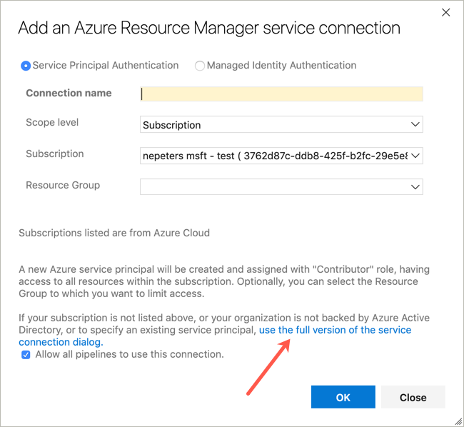
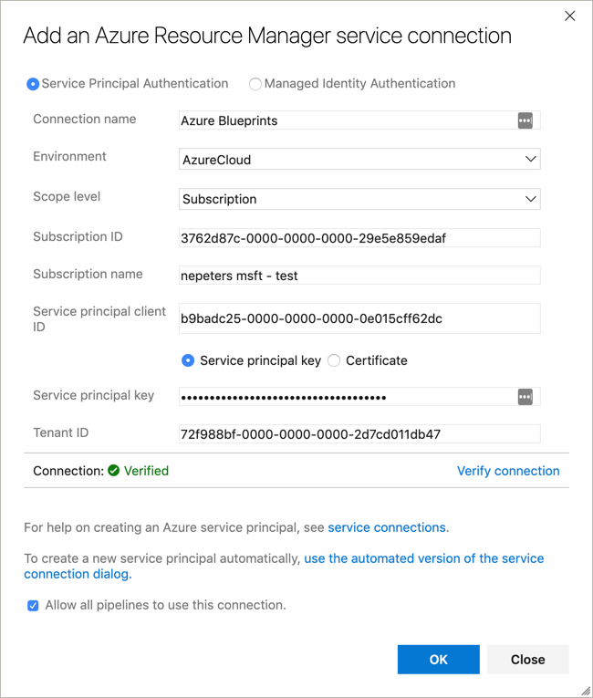

# Azure Pipeline tasks for Azure Blueprints

**Current Status**: Proof of concept / iterating on UX. The intention for this project is to refactor into Typescript once capability and functionality feels right.

## Create Service Principal

Create an Azure Pipeline service connection of type **Azure Resource Manager**. If your blueprints will be created and managed at an Azure Management Group a pre-created service principal is required that also has owner access to the management group.

Create a service principal using the [az ad sp create-for-rbac]() command.

```
$ az sp create-for-rbac

{
  "appId": "b9badc25-0000-0000-0000-0e015cff62dc",
  "displayName": "azure-cli-2019-04-10-12-48-25",
  "name": "http://azure-cli-2019-04-10-12-48-25",
  "password": "8741ec3c-0000-0000-0000-b66e70aede43",
  "tenant": "72f988bf-0000-0000-0000-2d7cd011db47"
}
```

## Grant Management Group Access

Grant the service principal access to the management group using the [az role assignment create]() command. The assignee is the appId of the service principal and the scope is the ID of the management group. Using the following example, replace `management-group-name` with the name of your management group.

```
az role assignment create --role owner --assignee b9badc25-0000-0000-0000-0e015cff62dc --scope https://management.azure.com/providers/Microsoft.Management/managementGroups/management-group-name
```

## Create Azure DevOps Serive Connection

Create an Azure DevOps project and then a new service connection with the type `Azure Resource Manager`. In the service connection dialog window, click `use the full version of the service connection dialog`.



For the service principal client ID enter the service principal `appId` and for the service principal key the `password.



## Create Blueprint Task

Create a task with the following schema to create a blueprint.

```
steps:
- task: nepeters.azure-blueprints.CreateBlueprint.CreateBlueprint@1
  displayName: 'Create Azure Blueprint'
  inputs:
    azureSubscription: 'Azure Blueprints'
    BlueprintName: 'demo-azd-007'
    BlueprintCreationLocation: managementGroup
    ManagementGroupName: 'nepeters-internal'
    BlueprintPath: './blueprints/create-blueprint/blueprint-body.json'
    ArtifactsPath: './blueprints/create-blueprint/artifacts'
    PublishBlueprint: true
    Version: Increment
```

| Property | Description |
|---|---|
| Azure Subscription | Used to authenticate with Azure. If the blueprint is created at a subscription, the subscription will also be assumed from this value. |
| Blueprint Name | Name for the Azure Blueprint. |
| Definition Location | Create the Blueprint at a Subscription or a Management Group. |
| Management Group Name | If creating at a Management Group, provide the name of the Management Group. |
| Blueprint Path | Relative path to the Blueprint .json file. |
| Artifact Path | Relative path to a directory containing all artifact JSON files. |
| Publish | Select to publish the Blueprint. |
| Version | The version can be specified as a string, int, or the value 'Increment' can be used. When using Increment, as long as the version is an int, the int will be incremented. |

## Assign Blueprint

Create a task with the following schema to assign a blueprint.

```
steps:
- task: nepeters.azure-blueprints.AssignBlueprint.AssignBlueprint@1
  displayName: 'Assign Azure Blueprint'
  inputs:
    azureSubscription: 'nepeters blueprints task test'
    BlueprintName: 'demo-azd-007'
    BlueprintCreationLocation: managementGroup
    ManagementGroupName: 'nepeters-internal'
    ParametersFile: './blueprints/assign-blueprint/assign-blueprint-body.json'
```

| Property | Description |
|---|---|
| Azure Subscription**: Used to authenticate with Azure. If the blueprint is created at a subscription, the subscription will also be assumed from this value. |
| Blueprint Name | Name for the Azure Blueprint. |
| Definition Location | Create the Blueprint at a Subscription or a Management Group. |
| Management Group Name | If creating at a Management Group, provide the name of the Management Group. |
| Parameters File Path | Relative path to the assignment parameters JSON file. |