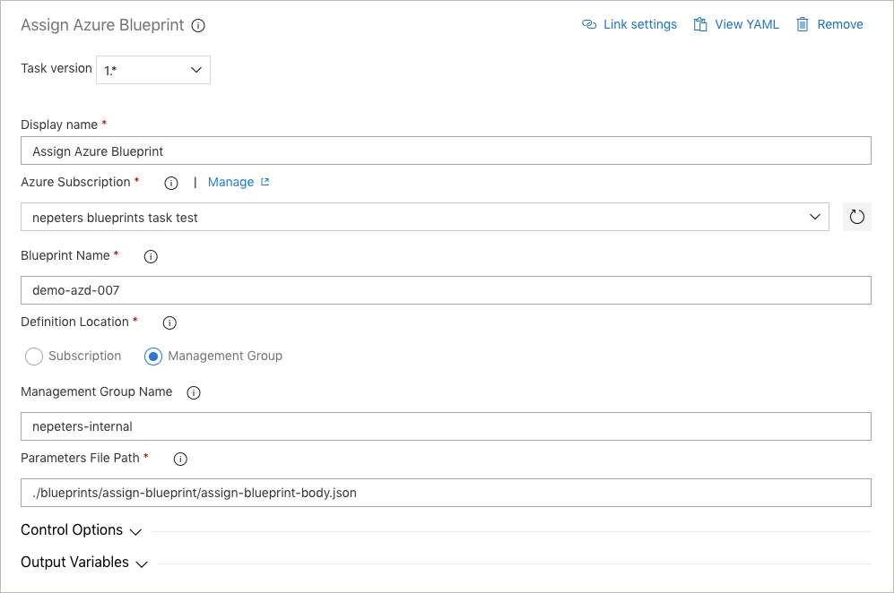

# POC: Azure Pipeline tasks for Azure Blueprints

Tasks to create, publish, version, update, and assign Azure Blueprints. POC only to iterate on capabilities and UI.

## Create / Update / Publish Blueprint


```
steps:
- task: nepeters.azure-blueprints.CreateBlueprint.CreateBlueprint@1
  displayName: 'Create Azure Blueprint'
  inputs:
    azureSubscription: 'nepeters blueprints task test'
    BlueprintName: 'demo-azd-007'
    BlueprintCreationLocation: managementGroup
    ManagementGroupName: 'nepeters-internal'
    BlueprintPath: './blueprints/create-blueprint/blueprint-body.json'
    ArtifactsPath: './blueprints/create-blueprint/artifacts'
    PublishBlueprint: true
```

- Azure Subscription: Used to authenticate with Azure. If the blueprint is created at a subscription, the subscription will also be assumed from this value.
- Blueprint Name: Name for the Azure Blueprint.
- Definition Location: Create the Blueprint at a Subscription or a Management Group.
- Management Group Name: If creating at a Management Group, provide the name of the Management Group.
- Blueprint Path: Relative path to the Blueprint .json file.
- Artifact Path: Relative path to a directory containing all artifact JSON files.
- Publish: Select to publish the Blueprint.
- Blueprint Version: The version can be specified as a string, int, or the value 'Increment' can be used. When using Increment, as long as the version is an int, the int will be incremented.

## Assign Blueprint



```
steps:
- task: nepeters.azure-blueprints.AssignBlueprint.AssignBlueprint@1
  displayName: 'Assign Azure Blueprint'
  inputs:
    azureSubscription: 'nepeters blueprints task test'
    BlueprintName: 'demo-azd-007'
    BlueprintCreationLocation: managementGroup
    ManagementGroupName: 'nepeters-internal'
    ParametersFile: './blueprints/assign-blueprint/assign-blueprint-body.json'
```

- Azure Subscription: Used to authenticate with Azure. If the blueprint is created at a subscription, the subscription will also be assumed from this value.
- Blueprint Name: Name for the Azure Blueprint.
- Definition Location: Create the Blueprint at a Subscription or a Management Group.
- Management Group Name: If creating at a Management Group, provide the name of the Management Group.
- Parameters File Path: relative path to the assignment parameters JSON file.