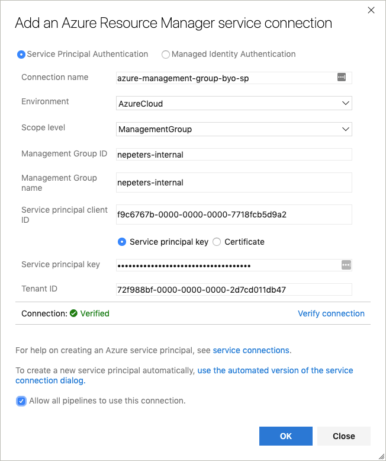
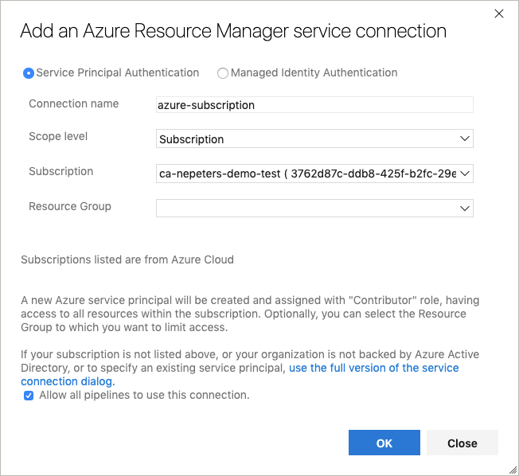

# Quickstart: Azure Blueprints tasks for Azure Pipelines

## Pre-create Azure Credentials

If your Blueprints will be created and managed at an Azure Management Group a pre-created service principal is required. This is due to a current limitation with the built-in service connections. If your Blueprints will be created and managed at an Azure Subscription, skip to the next step.

Create a service principal using the [az ad sp create-for-rbac]() command.

```
$ az sp create-for-rbac

{
  "appId": "b9badc25-0000-0000-0000-0e015cff62dc",
  "displayName": "azure-cli-2019-04-10-12-48-25",
  "name": "http://azure-cli-2019-04-10-12-48-25",
  "password": "8741ec3c-0000-0000-0000-b66e70aede43",
  "tenant": "72f988bf-0000-0000-0000-2d7cd011db47"
}
```

Grant the service principal access to the management group using the [az role assignment create]() command. The assignee is the appId of the service principal and the scope is the ID of the management group. Using the following example, replace `management-group-name` with the name of your management group.

```
az role assignment create --role owner --assignee b9badc25-0000-0000-0000-0e015cff62dc --scope https://management.azure.com/providers/Microsoft.Management/managementGroups/management-group-name
```

## Create Azure DevOps Serive Connection

Create an Azure DevOps project and then a new service connection with the type `Azure Resource Manager`. If your Blueprints will be created and managed at a Management Group, select `ManagementGroup` for the scope level and fill out the form with the credentials created in the last step.



If your Blueprints will be created and managed at a subscription, select the subscription.



## Create Blueprint Task

Create a task with the following schema to create a blueprint.

```
steps:
- task: nepeters.azure-blueprints.CreateBlueprint.CreateBlueprint@2
  displayName: 'Create Azure Blueprint'
  inputs:
    azureSubscription: 'azure-management-group-byo-sp'
    BlueprintName: 'test-001'
    BlueprintPath: './blueprints/create-blueprint/blueprint-body.json'
    ArtifactsPath: './blueprints/create-blueprint/artifacts'
    PublishBlueprint: true
```

## Assign Blueprint

Create a task with the following schema to assign a blueprint.

```
steps:
- task: nepeters.azure-blueprints.AssignBlueprint.AssignBlueprint@2
  displayName: 'Assign Azure Blueprint'
  inputs:
    azureSubscription: 'azure-management-group-byo-sp'
    BlueprintName: 'test-001'
    ParametersFile: './blueprints/assign-blueprint/assign-blueprint-body.json'
    SubscriptionID: '3762d87c-0000-0000-0000-29e5e859edaf'
```