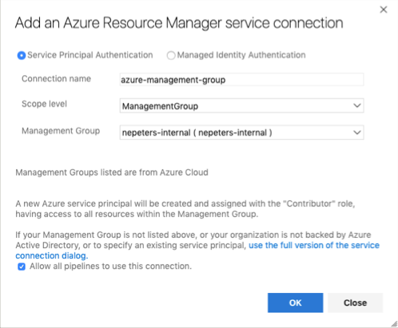

# Quickstart: Azure Blueprints tasks for Azure Pipelines

## Create Azure DevOps Serive Connection

Create an Azure DevOps project and then a new service connection with the type `Azure Resource Manager`. If your Blueprints will be created and managed at a Management Group, select `ManagementGroup` for the scope level.



## Create Blueprint Task

Create a task with the following schema to create a blueprint.

```
steps:
- task: nepeters.azure-blueprints.CreateBlueprint.CreateBlueprint@1
  displayName: 'Create Azure Blueprint'
  inputs:
    azureSubscription: 'azure-management-group'
    BlueprintName: 'blueprint-name'
    BlueprintCreationLocation: managementGroup
    ManagementGroupName: 'nepeters-internal'
    BlueprintPath: './blueprints/create-blueprint/blueprint-body.json'
    ArtifactsPath: './blueprints/create-blueprint/artifacts'
    PublishBlueprint: true
```

## Assign Blueprint

Create a task with the following schema to assign a blueprint.

```
steps:
- task: nepeters.azure-blueprints.AssignBlueprint.AssignBlueprint@1
  displayName: 'Assign Azure Blueprint'
  inputs:
    azureSubscription: 'nepeters blueprints task test'
    BlueprintName: 'demo-azd-007'
    BlueprintCreationLocation: managementGroup
    ManagementGroupName: 'nepeters-internal'
    ParametersFile: './blueprints/assign-blueprint/assign-blueprint-body.json'
```