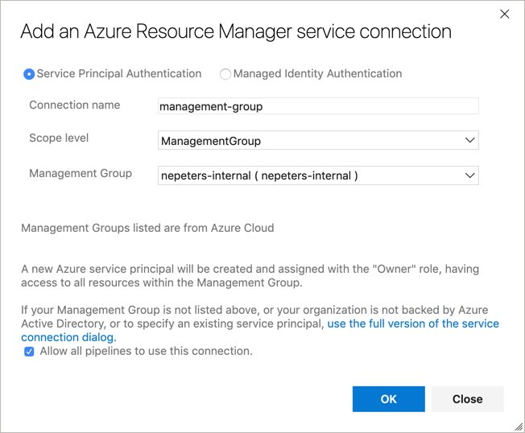

# Quickstart: Azure Blueprints tasks for Azure Pipelines

## Create Azure DevOps Serive Connection

Create an Azure DevOps project and then a new service connection with the type `Azure Resource Manager`. If your Blueprints will be created and managed at a Management Group, select `ManagementGroup` for the scope level.



If your Blueprints will be created and managed at a subscription, select the subscription.


## Create Blueprint Task

Create a task with the following schema to create a blueprint.

```
steps:
- task: nepeters.azure-blueprints.CreateBlueprint.CreateBlueprint@1
  displayName: 'Create Azure Blueprint'
  inputs:
    azureSubscription: 'nepeters-devops-mgmt'
    BlueprintName: 'blueprints-demo'
    BlueprintPath: create
    PublishBlueprint: true
```

## Assign Blueprint

Create a task with the following schema to assign a blueprint.

```
steps:
- task: nepeters.azure-blueprints.AssignBlueprint.AssignBlueprint@1
  displayName: 'Assign Azure Blueprint'
  inputs:
    azureSubscription: 'nepeters-devops-mgmt'
    AssignmentName: 'blueprints-demo-assignment'
    BlueprintName: 'blueprints-demo'
    ParametersFile: 'assign/assign-blueprint.json'
    SubscriptionID: '00000000-0000-0000-0000-000000000000'
    Wait: true
```
